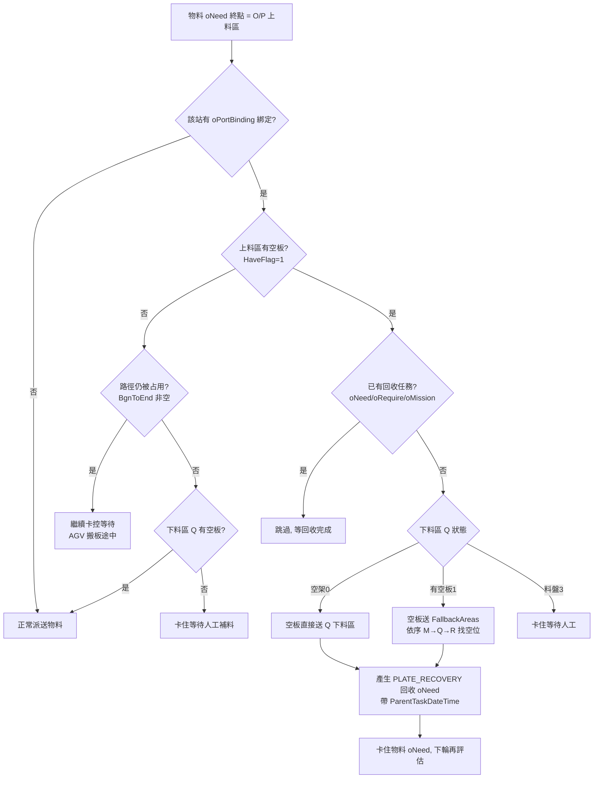
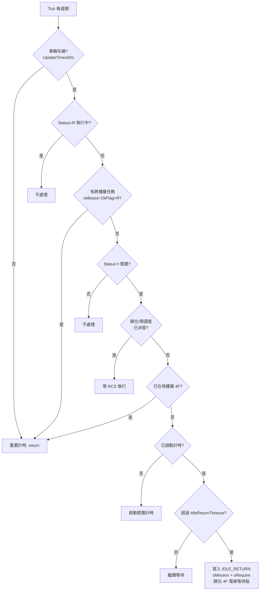
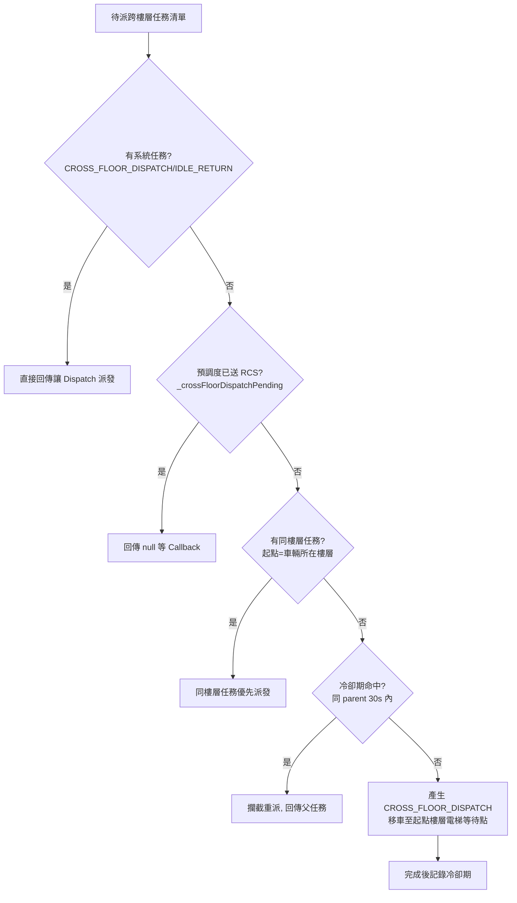
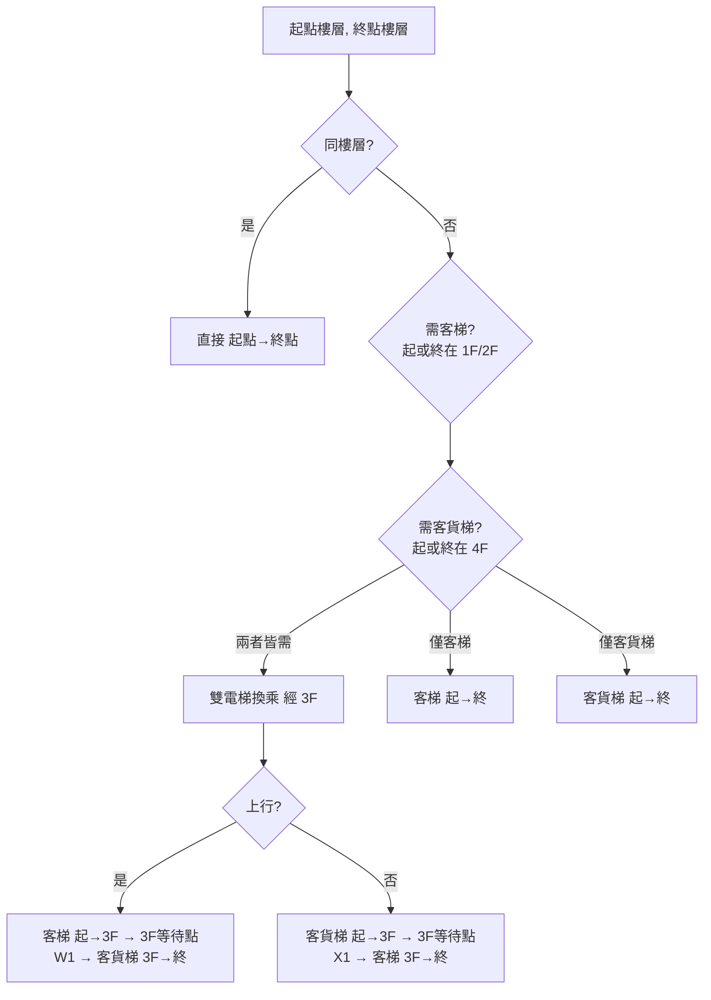
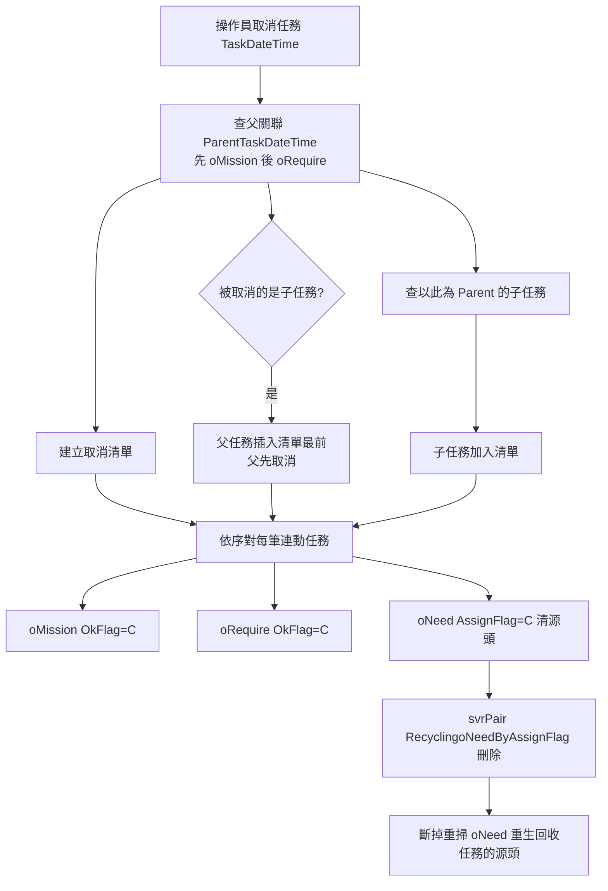
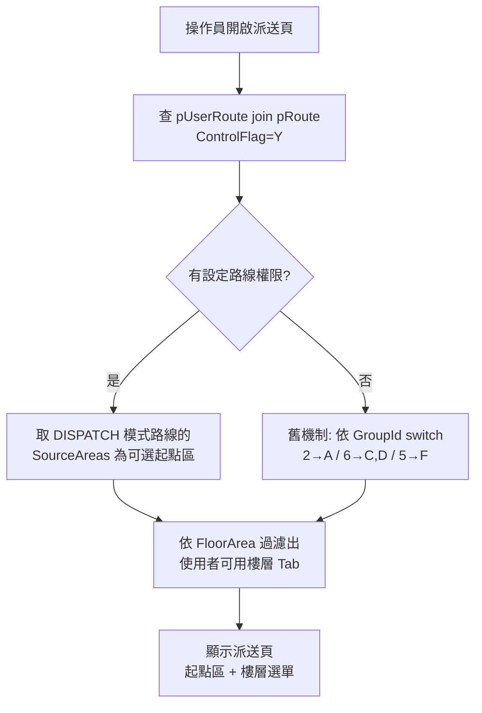

# 二廠 AGV 系統 — 各 Function 流程圖

**文件版本：** v1.0
**建立日期：** 2026-06-05
**權威來源：** 每張流程圖的分支與標記均對照實際程式碼（檔名 / 方法已標註）。

---

## 1. 二樓站內運輸（空平板自動回收）

**來源：** `Dispatch/svrPair/cPair.cs → CheckAndHandleEmptyPlateRecovery()`（cs:612–758）、前端卡控 `DispatchController.InsertoNeed()`。
**觸發：** 物料派往 O / P 上料區時，先檢查 `oPortBinding` 綁定的下料區（Q）狀態。
**任務標記：** `PLATE_RECOVERY`。

---

## 2. AGV 自動復歸（IDLE_RETURN）

**來源：** `ACC/.../CrossFloorManager.cs → Tick()`（cs:111–189）。每個 Dispatch 週期呼叫一次。
**觸發：** 跨樓層車輛（現場車號 3）閒置超過 `IdleReturnTimeout`（300s）且不在母樓層（4F）。
**任務標記：** `IDLE_RETURN`。

> 計時中若 `OnNewTaskArrived()` 進來新任務 → 取消計時優先派任務；歸位完成 `OnIdleReturnCompleted()` → 重置狀態。

---

## 3. 預派調度（CROSS_FLOOR_DISPATCH）

**來源：** `CrossFloorManager.cs → SelectNextMission()` / `DecideNextCrossFloorAction()`（cs:268–350）。
**觸發：** 有跨樓層待派任務，但車輛不在任務起點樓層。
**任務標記：** `CROSS_FLOOR_DISPATCH`。

> 冷卻期由 `CooldownTracker` 管控（預設 30s），防止 MapCode 被覆蓋後重派同一 parent；ACC 啟動時由 `ubMission` 歷史重建冷卻狀態。

---

## 4. 跨樓層電梯換乘路徑

**來源：** `ElevatorPathCalculator.cs → CalculatePath()` / `BuildReturnPath()`（cs:153–300）。
**電梯配置：** 客梯服務 1F–3F、客貨梯服務 3F–4F；3F 為兩梯轉乘樓層。

**換乘範例（主物料路線 2F↔4F）：**
- 上行 H(2F)→K(4F)：H → 客梯(2F→3F) → W1 → 客貨梯(3F→4F) → K
- 下行 K(4F)→H(2F)：K → 客貨梯(4F→3F) → X1 → 客梯(3F→2F) → H

> 每段電梯路徑由 `AddElevatorPath()` 展開為「等待點 → 電梯內(起) → 電梯內(終)」三點；等待點 / 電梯內點來自 `SectionElevator` 設定。

---

## 5. 任務取消連動（跨樓層取消重建管控 + 空平板取消清源頭）

**來源：** `DispatchController.cs → DeleteoNeed()`（cs:274–342）＋ `cPair.RecyclingoNeedByAssignFlag()` ＋ `CooldownTracker`。
**核心：** 以 `ParentTaskDateTime` 父子關聯，取消任一任務時連動取消其父 / 子任務，並從源頭 `oNeed` 清除，避免主循環重掃 oNeed 又重生。

> **跨樓層取消重建管控（功能 5）：** 預調度任務取消後，`CooldownTracker` 30s 冷卻期攔截同 parent 立即重派，避免「取消→又自動重建」的抖動。
> **空平板取消清源頭（功能 6）：** 卡控中的 M→O 物料任務只存在於 `oNeed`（未轉 oRequire/oMission），取消時標 `AssignFlag='C'` 交由 svrPair 清除，斷掉回收任務源頭。

---

## 6. 派送路由權限篩選（UI）

**來源：** `DispatchController.cs → Index()`（cs:32–132）。決定操作員派送頁可選的起點區與樓層。

> `RELEASE` 模式路線不顯示於派送選單，只供 Release 空板回送功能使用。此篩選僅控 UI，後端 `InsertoNeed()` 不再二次驗證 pRoute。

---

*本文件由 Claude Code 輔助生成，所有流程分支以實際程式碼確認。*
