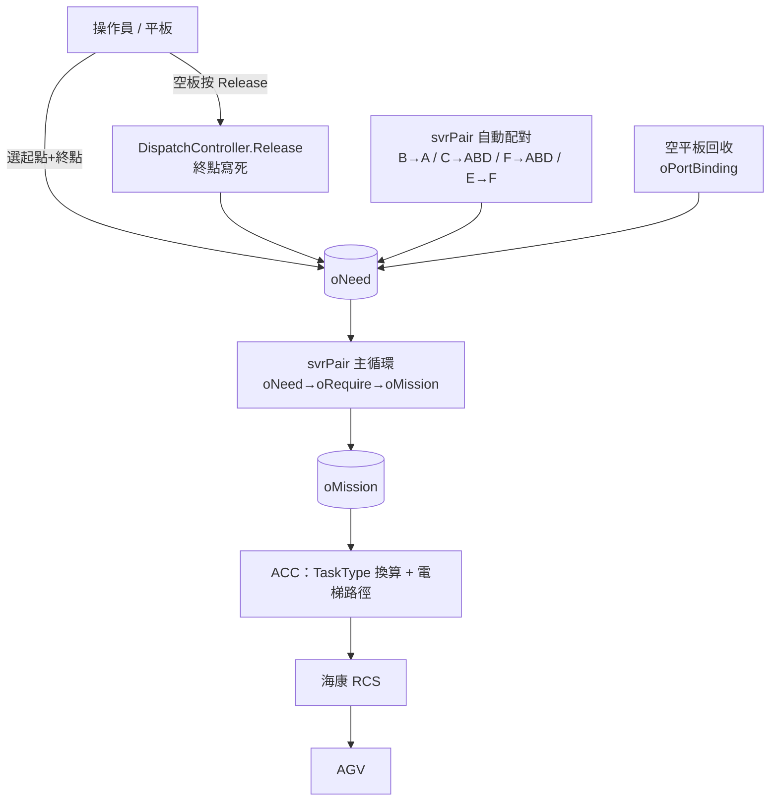

# 二廠 AGV 系統 — 派送路由對照表

**文件版本：** v1.0
**建立日期：** 2026-06-05
**權威來源：** 本表所有「站點 → 終點」規則均以**實際程式碼**為準逐一確認（檔名 / 方法已標註），非依設定表臆測。

---

## 0. 重要觀念：路由決策分散在三個系統的程式碼

二廠沒有「單一張路由表」決定每個站點能派去哪。實際的「站點 → 終點」決策**分散在三處**，依任務型態走不同機制：

| 機制 | 決策位置（程式碼）| 終點怎麼決定 |
|------|------------------|-------------|
| A. 手動派送（物料）| `SCP/Controllers/DispatchController.cs → InsertoNeed()` | 操作員在後台選終點；UI 可選範圍受 `pRoute` 權限約束 |
| B. 空板回送（Release）| `DispatchController.cs → Release()` | **寫死在程式碼**（依起點區判斷固定終點區）|
| C. 1F 站內自動配對 | `Dispatch/svrPair/cPair.cs` 主循環 | **區域規則**自動配對（受 `Recipe.ini` 開關控制）|
| D. 空平板自動回收 | `cPair.cs → CheckAndHandleEmptyPlateRecovery()` | 依 `oPortBinding` 上下料綁定 |
| E. 跨樓層任務執行 | `ACC/HikAGVWebAPI/App_Start/*` | 站點配對已定，ACC 只決定電梯路徑與 RCS TaskType |

> **`pRoute` 不是執行期路由權威** —— 它只控制 SCP 後台 UI「操作員能選哪些起點區 / 終點區」。後端 `InsertoNeed()` 不會再用 pRoute 二次驗證。詳見 §5。

---

## 1. 區域代碼總表

（來源：`WebGui/SCP/appsettings.json` 的 `Area` 區段，與現場一致）

| 區 | 樓層 | 名稱 | 區 | 樓層 | 名稱 |
|----|------|------|----|------|------|
| A | 1F | 備料區 | M | 2F | 雷雕備貨區 |
| C | 1F | 待料上料區 | N | 2F | 廢料回收區 |
| D | 1F | 待料下料區 | O | 2F | 左機台上料區 |
| F | 1F | 下料區 | P | 2F | 右機台上料區 |
| G | 1F | 電梯暫存區 | Q | 2F | 出料區 |
| H | 2F | 成型後 | R | 2F | 廢料區 |
| （B）| 1F | 暫存區（內部）| S | 2F | 清洗區 |
| （E）| 1F | 下料暫存（內部）| T | 2F | V cut 區 |
| J | 3F | 插針室 | I | 3F | 品檢區 |
| K | 4F | 烘烤前入貨區 | L | 4F | 烘烤後出貨區 |

> B、E 為系統內部暫存區，不出現在操作員派送選單。

---

## 2. 站點 → 終點對照（依決策機制）

### 2A. 手動派送（物料）— 操作員選終點，pRoute 約束 UI

操作員在 SCP 後台選起點區與終點站。可選範圍由 `pRoute` 權限決定（§5），實際業務上的合法配對如下：

| 起點區 | → 終點區 | 樓層 | 說明 | pRoute |
|--------|---------|------|------|--------|
| M（雷雕）| O / P | 2F 站內 | 雷雕完成料送機台上料 | ROUTE_2F_MT_TO_OP |
| T（V cut）| O / P | 2F 站內 | V cut 完成料送機台上料 | ROUTE_2F_MT_TO_OP |
| M（雷雕）| T | 2F 站內 | V cut 專用物料 | ROUTE_2F_VCUT |
| Q（出料）| S | 2F 站內 | 出料送清洗 | ROUTE_2F_Q_TO_S |
| R（廢料）| N | 2F 站內 | 廢料送回收 | ROUTE_2F_R_TO_N |
| H（成型後）| K | 2F→4F | 跨樓層送烘烤 | ROUTE_2F_4F |
| I（品檢）| L | 3F→4F | 跨樓層送烘烤後 | ROUTE_3F_4F |
| L（烘烤後）| I | 4F→3F | 跨樓層送品檢 | ROUTE_4F_3F |
| J（插針室）| G | 3F→1F | 跨樓層送電梯暫存 | ROUTE_3F_1F |

> 手動派送物料送至 **O / P 上料區**時，會觸發「空平板自動回收卡控」（§2D）。

### 2B. 空板回送（Release）— 終點寫死在程式碼

來源：`DispatchController.cs → Release()`（cs:667–832）。操作員對空板站點按 Release，終點由**起點區固定決定**：

| 起點區 | → 終點 | 程式邏輯（Release 內）|
|--------|--------|---------------------|
| G（1F 電梯暫存）| J 區空位（3F 插針室）| `stationArea=="G"` → 找 Block=J、HaveFlag=0 空位 |
| K（4F 烘烤前）| H 區空位（2F 成型後）| `stationArea=="K"` → 找 Block=H 空位 |
| I（3F 品檢）| L1–L4 空位（4F 烘烤後）| `stationArea=="I"` → 找 Block=L 且 Port 1–4，帶 `^RETURN`（NG 回送）|
| O / P / S / N | M → Q → R（依序找第一個空位）| 其餘區 → 先找 M，滿了找 Q，再滿找 R |

> Release 只在「站點標記為空板（HaveFlag=1）」時可執行；終點皆挑 `HaveFlag=0`、未被註冊、未被其他任務佔用的空位。

### 2C. 1F 站內自動配對 — svrPair 區域規則

來源：`cPair.cs` 主循環（`MainProcess`）。1F（A/B/C/D/E/F）維持原 MCS 自動配對邏輯，受 `Recipe.ini` 開關控制：

| 自動流向 | 程式方法 | 觸發 / 開關 |
|---------|---------|------------|
| B → A（暫存空 Rack 補上料區）| `GenerateoNeedDataByMCSAsBtoA` | 恆啟用 |
| B → C（暫存批配料號送生產）| `GenerateoNeedDataByMCSAsBtoC` | 僅 `PanelDoB2C=F` 時（**現場 =T，停用**）|
| C → A/B/D（空 Rack 補位 + 退貨）| `GenerateoNeedDataByMCSAsCtoABD` | `PanelDoB2C=T`（**現場啟用**）|
| F → A/B/D（下料空 Rack 補位）| `GenerateoNeedDataByMCSAsEtoABD` | `UnloadAuto=T`（**現場啟用**）|
| E → F（下料暫存批配送退 pin）| `GenerateoNeedDataByMCSEsBtoF` | 恆啟用 |

> 手動派送也走 1F 區（A→B、C→D、D→E、F），由操作員選；pRoute 對應 ROUTE_1F_A_TO_B / C_TO_D / D_TO_E / F_UNLOAD（§5）。1F 站內不做跨區卡控。

### 2D. 空平板自動回收（卡控）— oPortBinding

來源：`cPair.cs → CheckAndHandleEmptyPlateRecovery()`（cs:612–758）及 `DispatchController.InsertoNeed()` 前端卡控。
當物料要派往 **O / P 上料區**時，先檢查 `oPortBinding` 綁定的下料區（Q）狀態，必要時先回收空平板：

| 上料區狀態 | 下料區（Q）狀態 | 系統行為 |
|-----------|----------------|---------|
| 無空板 | 有空板 | 不回收，正常派物料 |
| 無空板 | 無空板 | 等待人工補料（卡住）|
| 有空板 | 空架（0）| 空板直接送下料區 Q（最理想）|
| 有空板 | 已有空板（1）| 空板送 FallbackAreas（依序 M→Q→R 找空位）|
| 有空板 | 有料盤（3）| 卡住等待人工 |

**oPortBinding 綁定**（來源 `Deploy_oPortBinding.sql`，FallbackAreas 全為 `M,Q,R`）：

```
O1→Q1  O2→Q2  O3→Q3  O4→Q4  O5→Q5  O6→Q6  O7→Q7  O8→Q8
P1→Q1  P2→Q2  P3→Q3  P4→Q4  P5→Q5  P6→Q6  P7→Q7  P8→Q8  P9→Q9
```

### 2E. 跨樓層任務執行 — ACC（TaskType + 電梯）

站點配對（起點/終點）在前述機制已決定；跨樓層任務送到 ACC 後，ACC 依**樓層方向**換算 RCS TaskType 代碼，並計算電梯路徑。處理檔案：
`ACC/HikAGVWebAPI/App_Start/`：`CrossFloorManager.cs`、`CrossFloorDecision.cs`、`ElevatorPathCalculator.cs`、`CooldownTracker.cs`；回調 `API/CallBackAPI.cs`。樓層→TaskType 對照見 §6。

---

## 3. 派送決策來源總覽



---

## 4. 站點分流入口（程式碼）

來源：`cPair.cs → ProcessSingleoNeed()` 的 switch（cs:201–239）。決定每筆 oNeed 走「平板配對」或「系統配對」：

- **平板配對**（操作員觸發）：`A C D F J H L M T Q R O P S N`
- **系統配對**（系統衍生）：`B E G K I`

兩者都呼叫 `ProcessoNeedToRequire()` 轉成 oRequire；O/P/S/N 在轉換前先過空平板卡控（§2D）。

---

## 5. pRoute 權限對照表（僅控 UI 權限，非執行期路由）

來源：`Deploy_pRoute.sql` + `Deploy_pRoute_1F.sql` + `Deploy_Update_Route_S.sql`。
用途：SCP 後台依使用者 `pUserRoute` 權限，過濾派送頁可選的**起點區與樓層**（`DispatchController.Index()` cs:32–132）。`DISPATCH`=顯示於派送選單；`RELEASE`=不顯示，只供 Release 功能。

| RouteId | 起點區 → 終點區 | 樓層 | 模式 |
|---------|----------------|------|------|
| ROUTE_2F_MT_TO_OP | M,T → O,P,S | 2F | DISPATCH |
| ROUTE_2F_Q_TO_S | Q → S | 2F | DISPATCH |
| ROUTE_2F_R_TO_N | R → N | 2F | DISPATCH |
| ROUTE_2F_VCUT | M → T | 2F | DISPATCH |
| ROUTE_2F_4F | H → K | 2F→4F | DISPATCH |
| ROUTE_3F_4F | I → L | 3F→4F | DISPATCH |
| ROUTE_4F_3F | L → I | 4F→3F | DISPATCH |
| ROUTE_3F_1F | J → G | 3F→1F | DISPATCH |
| ROUTE_1F_3F | G → J | 1F→3F | **RELEASE** |
| ROUTE_4F_2F | K → H | 4F→2F | **RELEASE** |
| ROUTE_1F_A_TO_B | A → B | 1F | DISPATCH |
| ROUTE_1F_C_TO_D | C → D | 1F | DISPATCH |
| ROUTE_1F_D_TO_E | D → E | 1F | DISPATCH |
| ROUTE_1F_F_UNLOAD | F →（下料完成）| 1F | DISPATCH |

> 注意：`ROUTE_2F_MT_TO_OP` 的終點區經 `Deploy_Update_Route_S.sql` 由 `O,P` 更新為含 `S`。

---

## 6. 樓層 → RCS TaskType 對照（oTaskTypeRoute）

來源：`Deploy_oTaskTypeRoute.sql`。ACC 依任務的起訖樓層查此表取得 RCS TaskType 代碼。
**多數仍為 `*Test` 測試代碼，正式上線須與 RCS 確認後更新（見建置手冊 §6）。**

| MoveType | 樓層 | TaskType | MoveType | 樓層 | TaskType |
|----------|------|----------|----------|------|----------|
| Transport | 1F→1F | F002 | Transport | 3F→4F | F34Test |
| Transport | 2F→2F | F001 | Transport | 4F→3F | F43Test |
| Transport | 1F→3F | F13Test | Transport | 2F→4F | F24Test |
| Transport | 3F→1F | F31Test | Transport | 4F→2F | F42Test |
| EmptyMove | 1F→4F | EM14 | EmptyMove | 4F→1F | EM41 |
| EmptyMove | 2F→4F | EM24 | EmptyMove | 4F→2F | EM42 |
| EmptyMove | 3F→4F | EM34 | EmptyMove | 4F→3F | EM43 |

> EmptyMove 用於跨樓層空車預調度 / 自動歸位（目的樓層多為 4F 母樓層）。

---

*本文件由 Claude Code 輔助生成，所有路由規則以實際程式碼逐一確認。*
