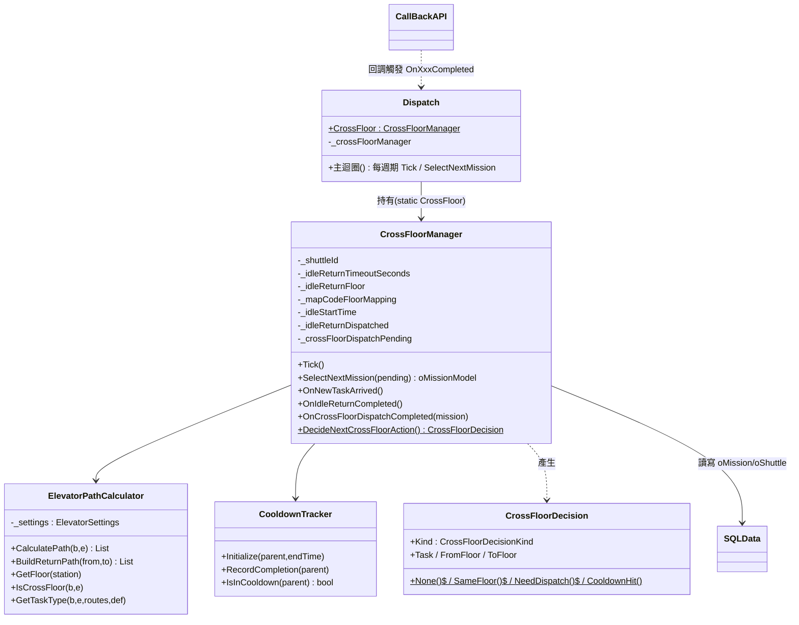
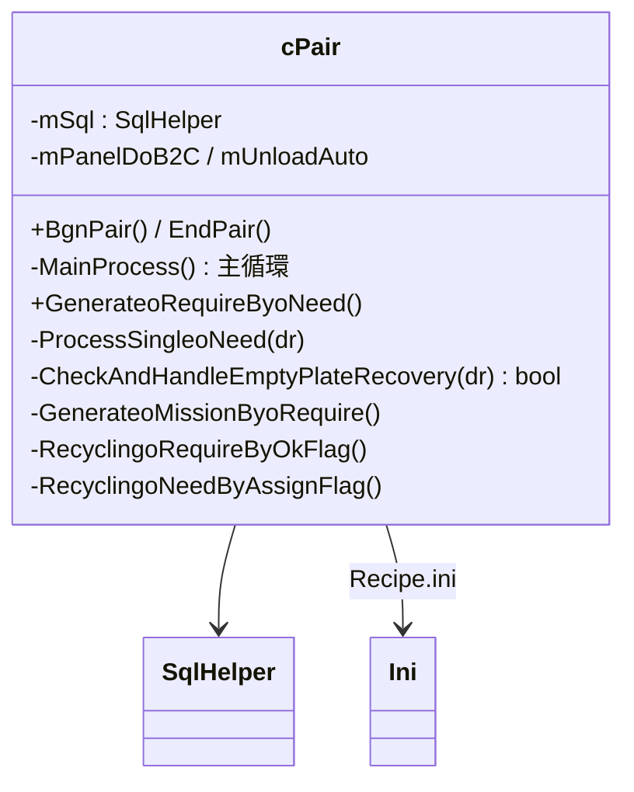
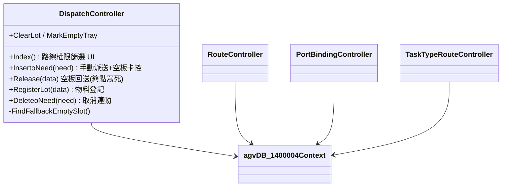
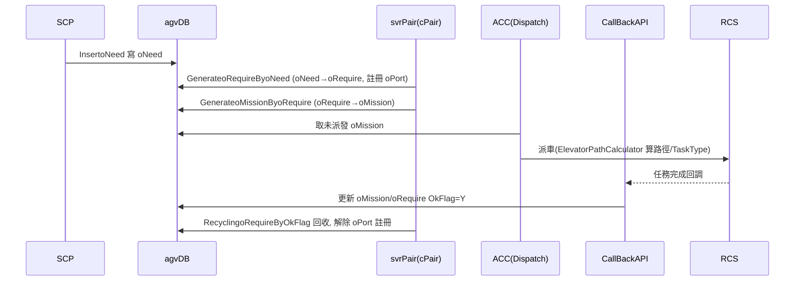
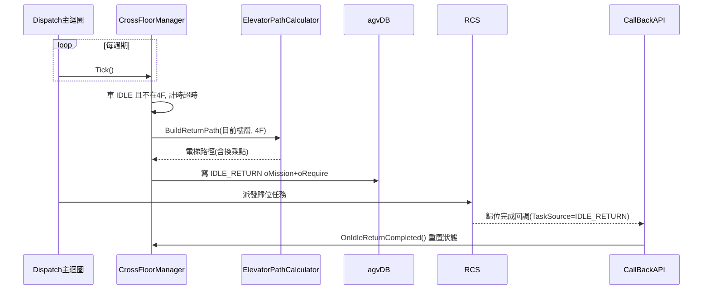

# 二廠 AGV 系統 — 系統 UML

**文件版本：** v1.0
**建立日期：** 2026-06-05
**詳細度：** 架構層級（核心類別 + 關鍵時序，不逐一展開所有成員）
**權威來源：** 類別成員與互動關係以實際程式碼確認（檔名 / 行號已標註）。

---

## 1. 核心類別圖

### 1.1 ACC（跨樓層調度核心）

### 1.2 Dispatch（svrPair 配對引擎）

### 1.3 SCP（後台網站）

---

## 2. 關鍵時序圖

### 2.1 一般搬運：派送 → 配對 → 派車 → 回調

### 2.2 跨樓層自動歸位（IDLE_RETURN）

> 預調度（CROSS_FLOOR_DISPATCH）時序類似：`SelectNextMission()` → `DispatchCrossFloor()` 寫 oMission → 回調 `OnCrossFloorDispatchCompleted(mission)` 重置並記錄冷卻期。

---

## 3. 關鍵狀態與旗標

| 旗標（CrossFloorManager）| 意義 |
|--------------------------|------|
| `_idleStartTime` | 閒置計時起點（null＝未計時）|
| `_idleReturnDispatched` | 歸位任務已寫入 oMission，待 RCS 執行 |
| `_crossFloorDispatchPending` | 預調度任務已送出，待回調 |

| oMission.TaskSource | 任務類型 |
|---------------------|---------|
| `MCS` | 一般搬運 / Release / 1F 自動配對 |
| `PLATE_RECOVERY` | 空平板自動回收 |
| `IDLE_RETURN` | 自動歸位 |
| `CROSS_FLOOR_DISPATCH` | 跨樓層預調度 |

---

*本文件由 Claude Code 輔助生成，類別與互動以實際程式碼確認；架構層級呈現，未逐一展開所有成員。*
