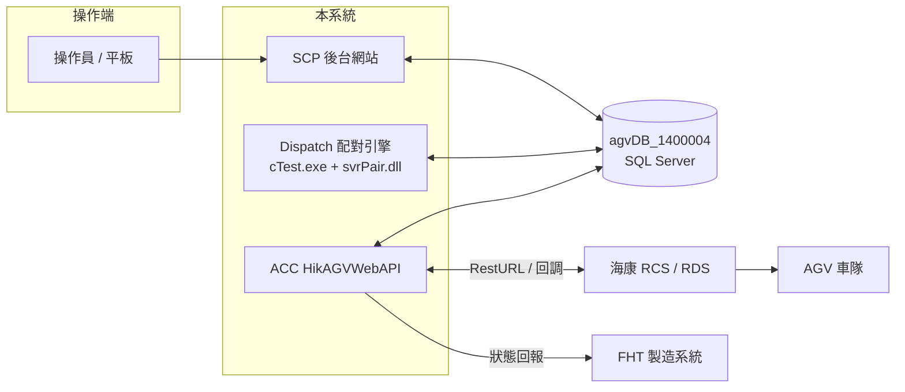

# 二廠 AGV 系統 — 系統建置 / 設定手冊

**文件版本：** v1.0
**建立日期：** 2026-06-05
**適用系統：** GlueNet.SAA.FHT.AgvTranfer.SecondFactory
**適用讀者：** 系統部署工程師、現場維護人員
**權威來源：** 本手冊所有設定值與部署順序均以實際程式碼 / 設定檔 / SQL 腳本為準確認

---

## 1. 系統組成與部署拓樸

二廠 AGV 系統由**三個獨立部署的子系統**組成，共用同一個 SQL Server 資料庫 `agvDB_1400004`：

| 子系統 | 專案 | 技術 | 角色 | 部署形式 |
|--------|------|------|------|---------|
| **SCP** | `WebGui/SCP` | ASP.NET Core | 後台網站：派送 / Release / 站點登記 / 路線權限管理 | IIS / Kestrel 站台 |
| **Dispatch** | `Dispatch/cTest` + `svrPair` | .NET Framework 4.8 | MCS 配對引擎（oNeed→oRequire→oMission 主循環） | 桌面程式（FleetManager）|
| **ACC** | `ACC/HikAGVWebAPI` + `HikAGV` | .NET Framework 4.8 | AGV 串接：派車 / 回調 / 跨樓層調度 / 電梯路徑 | IIS WebAPI 站台 |



> **資料流核心：** SCP/平板寫入 `oNeed` → Dispatch 主循環配對成 `oRequire` → 產生 `oMission` → ACC 取 `oMission` 派車給 RCS → AGV 執行 → RCS 回調 ACC → 更新任務狀態。詳見「各 Function 流程圖」與「系統架構」文件。

---

## 2. 環境需求

| 項目 | 需求 |
|------|------|
| 作業系統 | Windows 10 / Windows Server 2016 以上 |
| 資料庫 | SQL Server（含 SQL 帳號 `mcs` / 密碼 `Zz123456`，建立 `agvDB_1400004`）|
| .NET Runtime | .NET Framework 4.8（Dispatch、ACC）；ASP.NET Core Runtime（SCP，依專案 TFM）|
| Web 伺服器 | IIS（ACC WebAPI；SCP 若以 IIS 部署）|
| 網路 | 本系統三子系統、SQL Server、海康 RCS、FHT 系統之間互通 |

---

## 3. 資料庫部署

### 3.1 全新部署 SQL 執行順序（14 支，依相依關係）

> 所有正式腳本均具冪等性（`IF NOT EXISTS` / `MERGE` / 逐筆檢查），可安全重複執行。**執行前請先備份資料庫**（腳本未包交易）。

| 順序 | 腳本 | 用途 | 動作 |
|------|------|------|------|
| 1 | `Deploy_AddParentTaskDateTime.sql` | 跨樓層 / 連動取消關聯欄位 | ALTER：`oMission`、`ubMission` 加 `ParentTaskDateTime` |
| 2 | `Deploy_AddParentTaskDateTime_oNeedoRequire.sql` | 空平板取消連動清源頭 | ALTER：`oNeed`、`oRequire` 加 `ParentTaskDateTime` |
| 3 | `Deploy_oShuttle_AddUpdateTime.sql` | AGV 離線判定（60s） | ALTER：`oShuttle` 加 `UpdateTime` |
| 4 | `Deploy_ubCancelLog.sql` | 跨樓層取消日誌 | CREATE：`ubCancelLog` |
| 5 | `Deploy_oPortBinding.sql` | 上下料區綁定（空平板回收）| CREATE + INSERT：`oPortBinding` |
| 6 | `Deploy_oTaskTypeRoute.sql` | TaskType 路線對照（11 筆）| CREATE + INSERT：`oTaskTypeRoute` |
| 7 | `Deploy_pRoute.sql` | 路線定義主表（10 條）| CREATE + MERGE：`pRoute` |
| 8 | `Deploy_pRoute_1F.sql` | 追加 1F 站內路線（4 條）| MERGE：`pRoute` |
| 9 | `Deploy_Update_Route_S.sql` | 更新 2F 路線終點含 S 區 | UPDATE：`pRoute` ROUTE_2F_MT_TO_OP |
| 10 | `Deploy_pUserRoute.sql` | 使用者路線權限 + 管理員授權 | CREATE + MERGE：`pUserRoute`（UserId=1 全路線）|
| 11 | `Deploy_pFunction_RouteMenu.sql` | 後台選單：路線權限管理（504）| INSERT/UPDATE：`pFunction`、`pGroup` |
| 12 | `Deploy_pFunction_PortBindingMenu.sql` | 後台選單：上下料區綁定（505）| INSERT/UPDATE：`pFunction`、`pGroup` |
| 13 | `Deploy_pFunction_TaskTypeRouteMenu.sql` | 後台選單：TaskType 路由（506）| INSERT/UPDATE：`pFunction`、`pGroup` |
| 14 | `Verify_oTaskTypeRoute.sql` | 驗證 oTaskTypeRoute 與 HikAGV.config 一致（選用）| SELECT + PRINT（純讀）|

### 3.2 不納入正式部署

- `Deploy_LinkedCancel_Test.sql` — **純測試腳本**（含 `TEST_*` 測試資料的 INSERT/UPDATE/DELETE），僅供開發 / QA 在 SSMS 手動驗證連動取消邏輯，**不可在正式環境執行**。

### 3.3 程式版本更新（已有舊資料庫）

逐項確認欄位 / 表是否存在，缺者補執行對應腳本（因具冪等性，可全部重跑）：

```sql
-- 欄位類
SELECT ParentTaskDateTime FROM oMission;   -- 報錯 → 跑 #1
SELECT ParentTaskDateTime FROM oNeed;      -- 報錯 → 跑 #2
SELECT UpdateTime FROM oShuttle;           -- 報錯 → 跑 #3
-- 表類
SELECT * FROM oPortBinding;  SELECT * FROM oTaskTypeRoute;
SELECT * FROM pRoute;        SELECT * FROM pUserRoute;  SELECT * FROM ubCancelLog;
```

---

## 4. 各子系統設定檔

> ⚠️ 以下為實際設定檔目前的值（多為**開發 / 測試環境**值）。正式上線前必改項見 §6。

### 4.1 Dispatch（FleetManager）— `Recipe.ini`

位置：與 `cTest.exe` 同目錄（`Dispatch/Release/Recipe.ini`）。

| 鍵 | 目前值 | 說明 |
|----|--------|------|
| `DbName` | `agvDB_1400004` | 資料庫名稱 |
| `DbIp` | `127.0.0.1` | 資料庫位址 |
| `PanelDoB2C` | `T` | T＝B→C 上料由平板/WEB 處理（走 `GenerateoNeedDataByMCSAsCtoABD`）；F＝由 MCS 自動 B→C |
| `UnloadAuto` | `T` | T＝下料區空 Rack 自動補料（啟用 E/F→A,B,D 自動配對）|

### 4.2 SCP（後台網站）— `appsettings.json`

位置：`WebGui/SCP/appsettings.json`。

| 區段 | 鍵 | 目前值 | 說明 |
|------|----|--------|------|
| `ConnectionStrings` | `DBContext` | `Server=DESKTOP-2I3FKA2;Database=agvDB_1400004;...` | **目前指向開發機，上線必改** |
| `MyConfig` | `ShowRackIdField` | `false` | 物料登記是否顯示「貨架條碼」欄位 |
| `MyConfig` | `CSVPath` | `C:\Logs\ExpoerCSV` | CSV 匯出路徑 |
| `Area` | — | A~T 區域代碼 ↔ 中文名稱對照（**1F 含 G，已無 EE**）|
| `FloorArea` | — | 樓層 → 可選區域（1F: A,C,D,F,G／2F 站內: MT,M,Q,R,S／2F 站外: H／3F: J,I／4F: L）|
| `MapCodeMapping` | — | 地圖代碼 ↔ MapCode（FHT2-1F:AA, 2F:BB, 3F:DD, 4F:FF）|

### 4.3 ACC WebAPI — `Config/FHtSetting.config`

位置：`ACC/HikAGVWebAPI/HikAGVWebAPI/Config/FHtSetting.config`。自訂 ConfigurationSection（對應 `Models/ConfigModel.cs`）。

| 區段 | 設定 | 目前值 | 說明 |
|------|------|--------|------|
| `SectionDB` | DBIP / DBName / UserID / Password | `127.0.0.1` / `agvDB_1400004` / `mcs` / `Zz123456` | WebAPI 資料庫連線 |
| `SectionLog` | LogPath / KeepDate | `C:\Logs\` / `60` | 日誌路徑與保留天數 |
| `SectionFHt` | WebURL | `http://172.16.10.21//API//TeamService.ashx?ask=postMessage` | FHT 製造系統回報位址 |
| `SectionFHt` | Teamcode / APIAccount / APIKey | `291` / `va_2fd8...` / `fd337716-...` | FHT 介接憑證 |
| `SectionFHt` | LowBattery | `40,25` | 低電量門檻 |
| `SectionFHt` | **TestMode** | `false` | true＝跳過實際 FHT 呼叫（測試用）；**正式須 false** |
| `SectionElevator` | CustomerElevatorFloors | `1F,2F,3F` | 客梯停靠樓層 |
| `SectionElevator` | FreightElevatorFloors | `3F,4F` | 貨梯停靠樓層 |
| `SectionElevator` | *WaitPoints / *InsidePoints | 1F:U1/U2…等 | 電梯等待點 / 轎廂內點位 |
| `SectionElevator` | StationFloorMapping | `A:1F,...,K:4F,L:4F,...` | 站區 → 樓層對照 |

### 4.4 ACC RCS 串接層 — `Config/HikAGV.config`

位置：`ACC/HikAGVWebAPI/HikAGV/Config/HikAGV.config`。自訂 Section（對應 `HikAGV/Models/ConfigAGVModel.cs`）。**跨樓層調度設定在此檔**。

| 設定 | 目前值 | 說明 |
|------|--------|------|
| `AGVUrlSettings.RestURL` | `http://localhost:44300/rcms/services/rest/hikRpcService/{0}` | **測試路徑，正式須改海康 RCS 位址** |
| `AGVUrlSettings.AGVStatusURL` | `http://localhost:44300/rcms-dps/rest/{0}` | **測試路徑，正式須改** |
| `AGVSettings.AGVTaskType` | `F001` | 預設任務類型 |
| `AGVSettings.CrossFloorShuttleId` | **`3`** | 跨樓層車輛編號（歸位＋預調度共用）— 注意：實際部署為**車號 3** |
| `AGVSettings.IdleReturnTimeout` | `300` | 閒置歸位超時（秒）|
| `AGVSettings.IdleReturnFloor` | `4F` | 歸位目的樓層 |
| `AGVSettings.MapCodeFloorMapping` | `AA:1F,BB:2F,DD:3F,FF:4F` | MapCode → 樓層 |

---

## 5. Dispatch（FleetManager）部署件複製

Dispatch 子系統以「整個 `Dispatch/Release/` 資料夾複製到現場」方式部署。其內容分兩類：

| 類別 | 檔案 | 來源 |
|------|------|------|
| **自編產物**（由建置產生，已移出版控）| `cTest.exe`、`svrPair.dll`、`*.pdb` | 建置 `Dispatch/agvFleetManager.sln`（Debug 組態會輸出至 Release 部署目錄）|
| **第三方相依 / 設定**（版控保留）| `MsSql.dll`、`cTools.dll`、`SAA_PUBLIC.dll`、`Recipe.ini`、`cTest.exe.config` | git 版控 |

> **執行檔實為 `cTest.exe`**（非 svrPair）；`cTest` 以 ProjectReference 參考 `svrPair`。部署時確保上述兩類檔案齊全於同一目錄，並維護同目錄的 `Recipe.ini`。

部署步驟：
1. 建置 `agvFleetManager.sln`（產出 `cTest.exe` + `svrPair.dll` 至 `Dispatch/Release/`）。
2. 將整個 `Dispatch/Release/` 複製到現場 FleetManager 機器。
3. 依 §4.1 設定 `Recipe.ini`。
4. 啟動 `cTest.exe`，確認配對主循環運作（觀察 `Log/` 輸出）。

---

## 6. 正式環境上線前必改清單 ⚠️

以下為**目前設定檔仍是開發 / 測試值**、上線前必須調整的項目（皆 code/設定檔確認）：

- [ ] **RCS 串接位址**：`HikAGV.config` 的 `RestURL` / `AGVStatusURL` 由 `localhost:44300` 改為現場海康 RCS 實際位址。
- [ ] **SCP 資料庫連線**：`appsettings.json` 的 `DBContext` 由 `DESKTOP-2I3FKA2` 改為正式 SQL Server。
- [ ] **三系統 DB 位址一致性**：`Recipe.ini`（`DbIp`）、`FHtSetting.config`（`DBIP`）、`appsettings.json` 須一致指向正式資料庫。
- [ ] **跨樓層車輛編號**：確認 `HikAGV.config` 的 `CrossFloorShuttleId`（目前 `3`）與現場實際跨樓層車一致。
- [ ] **FHT TestMode**：確認 `FHtSetting.config` 的 `TestMode="false"`。
- [ ] **FHT 介接位址 / 憑證**：確認 `WebURL`、`Teamcode`、`APIAccount`、`APIKey` 為正式值。
- [ ] **資料庫部署**：依 §3.1 全 14 支腳本執行完成（`Deploy_LinkedCancel_Test.sql` 除外）。
- [ ] **站點 / 路線資料**：`oPort`、`oPortBinding`、`pRoute`、`oTaskTypeRoute` 與現場實際佈署一致（TaskType 代碼須與 RCS 確認）。

---

*本手冊由 Claude Code 輔助生成，所有設定值以實際檔案逐一確認。如有疑問請聯繫開發團隊。*
