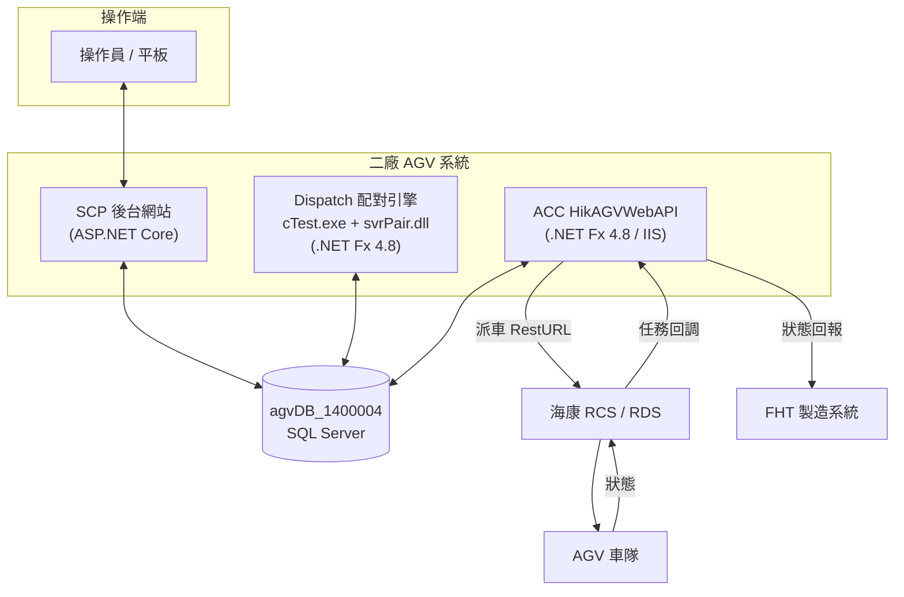
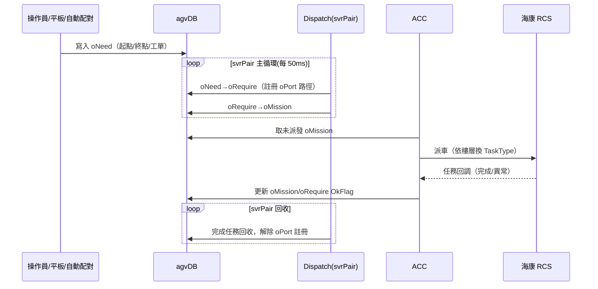
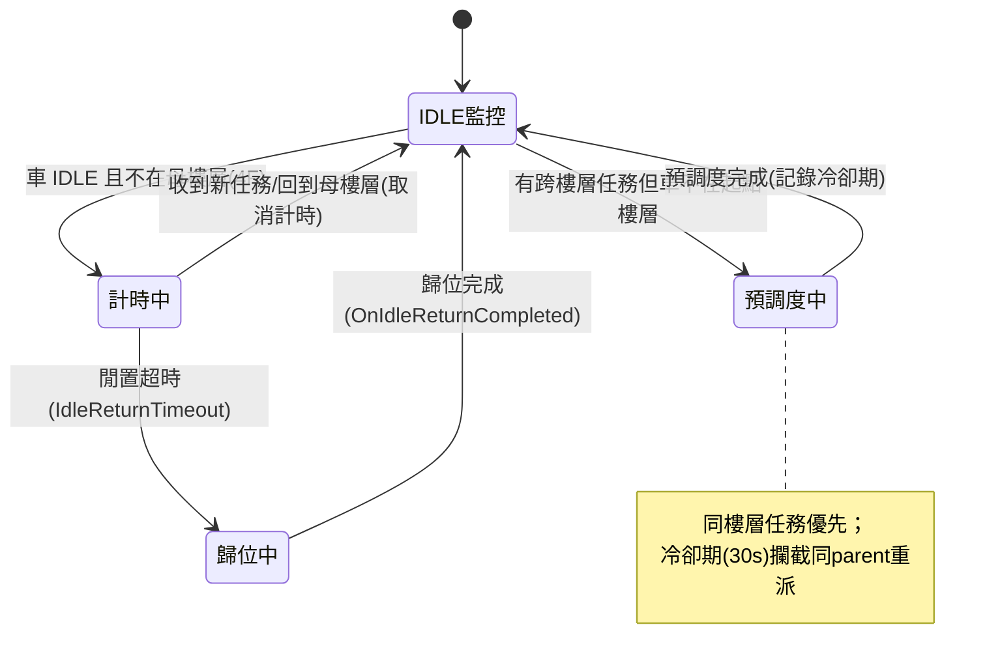

# 二廠 AGV 系統 — 系統架構

**文件版本：** v1.0
**建立日期：** 2026-06-05
**詳細度：** 架構層級（組件、邊界、資料流、功能落點）
**權威來源：** 各組件職責與功能落點均以實際程式碼確認（檔名 / 類別 / 方法已標註）。

---

## 1. 系統定位

二廠 AGV 系統由三個獨立部署、共用同一 SQL Server 資料庫的子系統組成：

| 子系統 | 專案路徑 | 技術 | 核心職責 |
|--------|---------|------|---------|
| **SCP**（後台網站）| `WebGui/SCP` | ASP.NET Core | 操作員介面：物料登記、手動派送、Release 空板回送、路線權限管理、任務取消、戰情監控 |
| **Dispatch**（配對引擎 / FleetManager）| `Dispatch/svrPair`＋`cTest` | .NET Framework 4.8 | MCS 主循環：將 `oNeed` 配對成 `oRequire`、產生 `oMission`、回收完成任務、空平板自動回收與 1F 站內自動補料 |
| **ACC**（AGV 串接）| `ACC/HikAGVWebAPI`＋`HikAGV` | .NET Framework 4.8 | 取 `oMission` 派車給海康 RCS、接收回調、跨樓層調度（歸位 / 預調度 / 電梯路徑）、回報 FHT |

---

## 2. 部署架構與外部邊界

**邊界說明：**
- 三子系統**不直接互相呼叫**，全透過共用資料庫 `agvDB_1400004` 的任務表交換狀態（鬆耦合）。
- 對外只有 ACC 與海康 RCS（派車 / 回調）及 FHT（狀態回報）整合；AGV 由 RCS 控制。

---

## 3. 任務生命週期（核心資料流）

一般搬運任務由 `oNeed → oRequire → oMission` 三段推進：

> **跨樓層系統任務的特殊路徑：** 自動歸位（`IDLE_RETURN`）與預調度（`CROSS_FLOOR_DISPATCH`）**不經 oNeed**，由 ACC 的 `CrossFloorManager` 直接寫入 `oMission`（歸位另寫 oRequire，預調度不寫 oRequire，靠 `ParentTaskDateTime` 與 MCS 任務連動取消）。

---

## 4. 新增功能落點對照

| # | 新增功能 | 主要落點（程式碼）| 任務標記 |
|---|---------|------------------|---------|
| 1 | 二樓站內運輸（空平板自動派送）| SCP `DispatchController.InsertoNeed()`（前端卡控）＋ Dispatch `cPair.CheckAndHandleEmptyPlateRecovery()` ＋ `oPortBinding` | `PLATE_RECOVERY` |
| 2 | AGV 自動復歸 | ACC `CrossFloorManager.Tick()` → `DispatchIdleReturn()` | `IDLE_RETURN` |
| 3 | 預派調度（跨樓層預調度）| ACC `CrossFloorManager.SelectNextMission()` / `DecideNextCrossFloorAction()` → `DispatchCrossFloor()` ＋ `CooldownTracker` | `CROSS_FLOOR_DISPATCH` |
| 4 | 跨樓層電梯換乘 | ACC `ElevatorPathCalculator`（`BuildReturnPath()`）＋ `SectionElevator` 設定 | — |
| 5 | 跨樓層任務取消後自動重建（行為管控）| SCP `DispatchController.DeleteoNeed()`（`ParentTaskDateTime` 連動取消）＋ ACC `CooldownTracker`（30s 內攔截同 parent 重派）| — |
| 6 | 空平板取消連動清源頭 | SCP `DispatchController.DeleteoNeed()`（標 `oNeed.AssignFlag='C'`）＋ Dispatch `cPair.RecyclingoNeedByAssignFlag()` ＋ `ParentTaskDateTime` | — |
| 7 | 派送路由 / 路線權限 | SCP `RouteController` ＋ `DispatchController.Index()`（pRoute/pUserRoute 篩選 UI）| — |

> 功能 2、3、5 共用 ACC 的 `CrossFloorManager`；功能 1、6 共用 `ParentTaskDateTime` 父子關聯欄位。

---

## 5. 核心資料表角色

| 資料表 | 角色 | 維護者 |
|--------|------|--------|
| `oNeed` | 派送需求（最上游，平板/WEB/自動配對寫入）| SCP / svrPair 寫，svrPair 回收 |
| `oRequire` | 已配對的需求（含 oPort 路徑註冊）| svrPair |
| `oMission` | 實際派車任務（ACC 取此派 RCS）| svrPair / ACC（系統任務）|
| `oPort` | 站點狀態（HaveFlag 空架/空板/料盤、BgnToEnd 路徑註冊）| svrPair / SCP / AGV 回報 |
| `oShuttle` | AGV 車輛狀態（Status、MapCode、UpdateTime）| ACC（RCS 回報）|
| `oPortBinding` | 上下料區綁定（空平板回收）| 後台 / SQL |
| `pRoute` / `pUserRoute` | 路線定義 / 使用者權限（UI 篩選）| 後台 / SQL |
| `oTaskTypeRoute` | 樓層 → RCS TaskType 對照 | SQL（須與 RCS 確認）|
| `ubMission` / `ubCancelLog` | 歷史任務 / 取消日誌 | 系統 |

> `ParentTaskDateTime` 欄位（`oNeed`/`oRequire`/`oMission`/`ubMission`）串起父子任務，支撐功能 5、6 的連動取消。

---

## 6. 跨樓層調度狀態機（CrossFloorManager 摘要）

跨樓層車輛（`HikAGV.config` 的 `CrossFloorShuttleId`，現場為車號 3）由 ACC `CrossFloorManager` 每個 Dispatch 週期 `Tick()` 一次管控：

關鍵規則（程式碼確認）：
- 車輛 `UpdateTime` 超過 60 秒未更新 → 視為離線，不計時。
- `Status=R`（執行中）或 `oMission` 仍有跨樓層任務 `OkFlag=R` → 不處理。
- 同樓層任務優先於跨樓層預調度；預調度完成後 30 秒冷卻期防止同 parent 重派（`CooldownTracker`，啟動時由 `ubMission` 歷史重建）。

---

*本文件由 Claude Code 輔助生成，功能落點以實際程式碼確認。*
